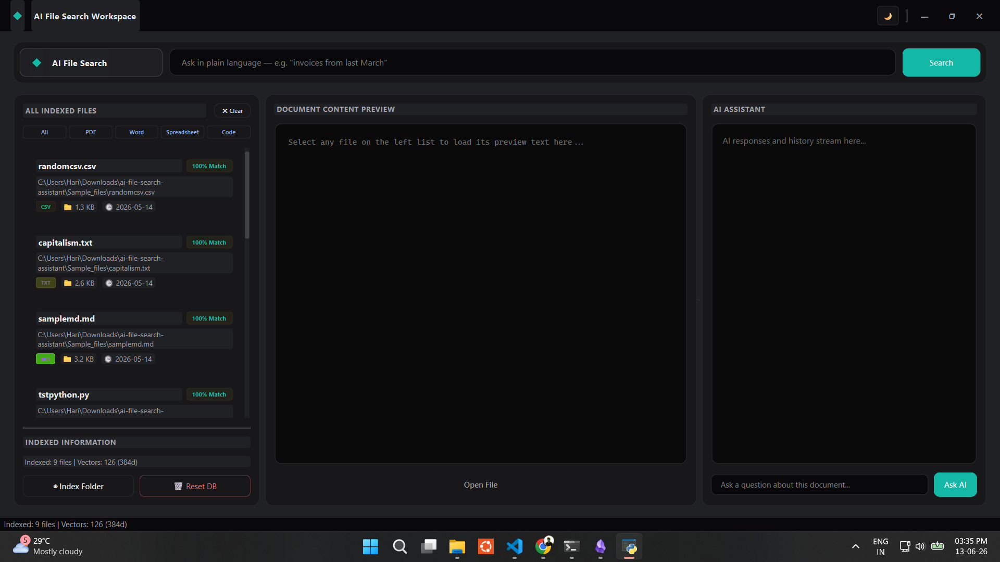

# AI File Search Assistant

[](https://www.python.org/)
[](https://wiki.qt.io/Qt_for_Python)
[](https://github.com/facebookresearch/faiss)
[](https://ai.google.dev/)
[](LICENSE)

An end-to-end, local semantic document search and conversational assistant workspace. The core engine blends traditional keyword searching (**SQLite FTS5**) with local vector matching (**SentenceTransformers & CPU FAISS**) to perform hybrid file retrieval. Using a Retrieval-Augmented Generation (RAG) architecture, it passes relevant document segments to the **Gemini API** for multi-turn conversational Q&A, all housed within an optimized, thread-safe **PySide6** desktop interface.

---

## 📸 Application Preview

<p align="center">
  
</p>

---

## 🌟 Key Features

* **Hybrid Search Engine**: Blends exact keyword matches (SQLite FTS5 BM25) and semantic similarity (FAISS vector inner product) using a customized rank score formula (`0.7 * semantic + 0.3 * keyword`).
* **Multi-Format Extractor Registry**: A class-based extractor pipeline supporting plain text, Markdown, source code, HTML, PDF, Word, PowerPoint, Excel, CSV, and image files.
* **On-the-Fly Local OCR**: Automated PDF page scanned detection (falls back to rendering pages to PNG and running local `RapidOCR` ONNX runtime) and direct image OCR.
* **Local Chunk-Level Semantic Indexing**: splits document contents into overlapping character-level segments (800 size / 150 overlap) for precise semantic retrieval, avoiding whole-file contextual dilution.
* **Thread-Safe Background Orchestration**: Scans directories, updates relational indices, computes embeddings, and performs searches inside async QThreads, preserving a 60 FPS UI.
* **Interactive Local RAG Chat**: Computes prompt-to-chunk cosine similarity on the fly to inject the top 5 relevant chunks as LLM context, caching conversational sessions using MD5 hashes.

---

## 🛠️ Technology Stack

* **Core GUI Framework**: PySide6 (Qt6) & PyQtDarkTheme
* **Local Embeddings**: SentenceTransformers (`all-MiniLM-L6-v2` generating 384d vectors) & PyTorch
* **Vector Indexing**: Facebook AI Similarity Search (FAISS)
* **Metadata & Keyword Indexing**: SQLite3 (incorporating FTS5 porter-unicode tokenization)
* **Image OCR & Local Runtimes**: RapidOCR ONNX Runtime
* **Cloud LLM Integration**: Google GenAI Python SDK (`gemini-2.5-flash` / `gemini-1.5-flash`)
* **Document Parsers**: PyMuPDF (fitz), python-docx, python-pptx, openpyxl, beautifulsoup4

---

## ⚙️ System Workflow Diagram

```text
[Local Folder Scan]
        │
        ▼ (Skip files > 50MB, check modification timestamps)
[Parallel Text Extraction] ── (fitz, docx, pptx, openpyxl, RapidOCR)
        │
        ▼
[Truncation & Sentence Chunking] ── (Size: 800, Overlap: 150)
        │
        ├─────────────────────────────────────────┐
        ▼ (Write Content & Chunks)                ▼ (Batch Vector Generation)
[SQLite & chunks_fts virtual table]        [SentenceTransformer Embeddings]
        │                                         │
        v                                         ▼ (Add by Chunk Primary Keys)
[Relational Metadata Cache]                [FAISS FlatIP Vector Index]
        │                                         │
        └───────────────────┬─────────────────────┘
                            ▼
                    [Hybrid Search] 
          0.7 * Cosine similarity + 0.3 * BM25
                            │
                            ▼
                 [Group by Parent File]
                            │
                            ▼
            [Interactive 3-Column Workspace]
         (Files list ── preview ── RAG Chat)
```

---

## 📂 Project Structure

```text
ai-file-search-assistant/
├── main.py                     # Entry point & QApplication loop
├── requirements.txt            # Python dependencies manifest
├── INFO.md                     # Detailed technical architecture guide
├── app/
│   ├── chat/
│   │   └── chat_engine.py      # Local chunk similarity lookup & Gemini Q&A
│   ├── database/
│   │   └── db_manager.py       # SQLite relational tables & FTS5 search
│   ├── embeddings/
│   │   └── embedding_manager.py# SentenceTransformers model lazy-loader
│   ├── extraction/
│   │   └── extractor.py        # Text & metadata extractor registry
│   ├── indexing/
│   │   └── file_indexer.py     # Scanning and transactional indexing pipeline
│   ├── search/
│   │   ├── faiss_manager.py    # FAISS binary vector wrapper
│   │   └── search_engine.py    # Hybrid blending search ranking
│   └── ui/
│       ├── main_window.py      # PySide6 desktop GUI 3-column dashboard
│       ├── ai_assistant.png    # Empty state chat illustration
│       └── no_file_selected.png# Empty state preview illustration
├── data/
│   ├── metadata.db             # SQLite database file
│   └── faiss.index             # Persisted FAISS vector index binary
├── models/
│   └── all-MiniLM-L6-v2/       # Local SentenceTransformer directory
├── tests/
│   └── test_pipeline.py        # End-to-end command line test script
└── Sample_files/               # Test documents directory
```

---

## 🚀 Getting Started

### 1. Installation

Clone this repository and navigate to the project directory:
```bash
git clone https://github.com/har1prasad/ai-file-search-assistant.git
cd ai-file-search-assistant
```

Create a virtual environment and install dependencies:
```bash
python -m venv .venv
.venv\Scripts\activate      # On Windows
source .venv/bin/activate   # On macOS/Linux

pip install -r requirements.txt
```

### 2. Environment Configuration
Create a `.env` file in the root directory and supply your Gemini API key:
```env
GEMINI_API_KEY=your_gemini_api_key_here
```

### 3. Running the Desktop Workspace
Launch the dashboard interface:
```bash
python main.py
```

### 4. Running Pipeline Tests
Execute the testing suite to verify directory scanning, text chunking, and database storage offline:
```bash
python tests/test_pipeline.py
```

---

## 🏋️ Indexing & Q&A Workflow

1. **Folder Selection**: Click **⊕ Index Folder** on the bottom of the left column. Select your reference directory (e.g. `Sample_files/`).
2. **Hybrid Search**: Type your query in the top center bar (or press `Ctrl+K`/`Ctrl+F` to focus it) and press Enter. The dashboard will rank files based on semantic and keyword overlap.
3. **Interactive Q&A**: Select a file to preview its content in the center panel. Ask questions in the right chat input box; the chat assistant retrieves context chunks and displays a markdown response.

---

## 🔮 Future Improvements

1. **Local LLM Support (Ollama)**: Enable integration with offline models (e.g. LLaMA3, Mistral) to support a fully local private RAG workflow.
2. **Metadata-Bound Filtering**: Expose filters in the UI to narrow searches by date, format, file size, or specific path sub-trees.
3. **Graph-RAG Relationships**: Map entity links and cross-references between different files inside the database for multi-document reasoning.

---

## 📄 License

Distributed under the MIT License. See `LICENSE` for more information.